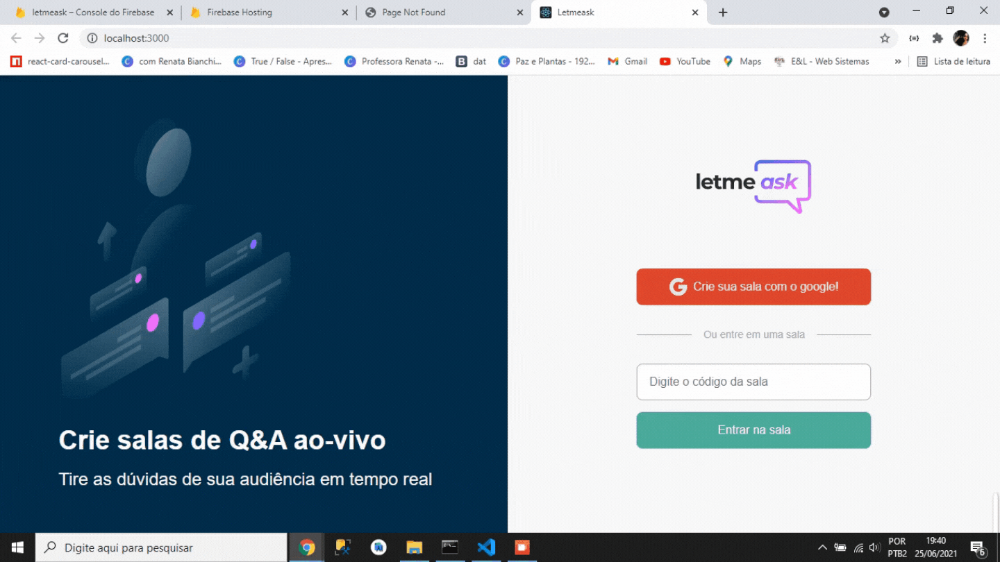

# nlwLetMeAsk
LetMeAsk é um projeto desenvolvido na NLW - Rocketseat que visa construir uma plataforma que é capaz de criar salas sobre temas diversos os quais participantes poderão questionar,
curtir perguntas dos outros e  administrador pode comentar, marcar como respopndida, excluir perguntas e excluir a sala.

Nessa aplicação foram trabalhados vários conceitos: 
<ul>
    <li> React </li>
    <li> Componentes, estados, parâmetros </li>
    <li> Integração com Firebase para autenticação de usuário </li>
    <li> Código limpo </li>
    <li> Estilização com sass </li>
    <li> Hoocks </li>
    <li> Rotas </li>
    
</ul>

As principais ferramentas foram *React, Typescript, Firebase* 

  

